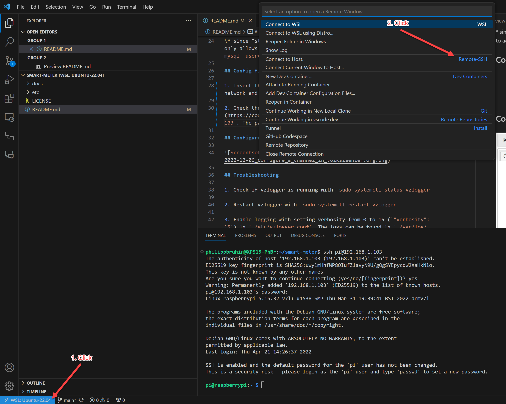
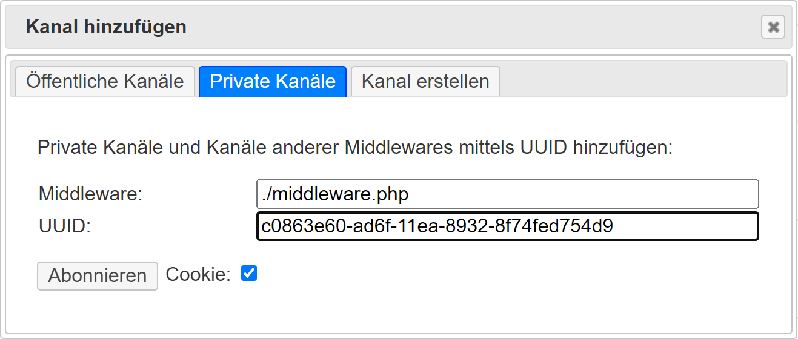

# Electrical power consumption measurement and visualization

This repo serves as documentation for the [volkszaehler.org](https://github.com/volkszaehler/volkszaehler.org) project, which I am using to measure and visualize the electrical consumption of my home (heat pump, oven, washing machine, dryer etc.).

## Hardware

* **IR-Read-Write-Head** with TTL interface that I purchased as a kit with a pre-assembled circuit board from [Hichi]( https://www.photovoltaikforum.com/thread/141332-neue-lesekopf-baus%C3%A4tze-ohne-smd-l%C3%B6ten/).
* **Raspberry PI 4** with 32 GB SD card and image from [wiki.volkszaehler.org/howto/raspberry_pi_image](https://wiki.volkszaehler.org/howto/raspberry_pi_image).
* **Siemens TD-3511 smart meter** which has been installed by [EW Wangen SZ]( https://www.ewwangensz.ch/), what is the power supply company in the area where I live.

## Software

The Raspberry PI image can be downloaded on [wiki.volkszaehler.org](https://wiki.volkszaehler.org/howto/raspberry_pi_image) (website only in German language available) or [here](https://demo.volkszaehler.org/downloads/volkszaehler_latest.zip) as `*zip` file. Default passwords of the image are as follows.

| Application                 | User         | Password  |
|-----------------------------|--------------|-----------|
| Console                     | pi           | raspberry |
| ssh (console via network)   | pi           | raspberry |
| User for vzlogger           | vzlogger     | vzlogger  |
| MySQL-Standarduser          | vz           | demo      |
| MySQL-Comprehensiveuser     | vz-admin     | secure    |
| MySQL-Admin*                | root         | raspberry |

\* since "stretch" an additional security has been built in which only allows the system user root to access the DB as root. (`sudo mysql –user=root -praspberry`)

## Config file of vzlogger

1. Insert the Micro-SD card into the Raspberry PI, connect it to a network and power it.

2. Check the IP address and connect to the Raspberry via [VS-Code](https://code.visualstudio.com/). as shown below



3. `+ Add New SSH Host...`

4. In my case it is `ssh pi@192.168.1.103` and The password is `raspberry`.

5. To see the file eplorer klick **File** > **Open file...** and then choose the folder `etc`.  Password is again `raspberry`.

6. Open the file `vzlogger.conf` and override the file with the content of [etc/vzlogger.conf](./etc/vzlogger.conf). If you don't have the userrights to override the file, run `sudo chown -R pi /etc`.

7. Run `sudo systemctl enable vzlogger`.

8. Visit [http://192.168.1.103/](http://192.168.1.103/), choose **Kanal erstellen** and add following.


9. As soon as the entries are created once, they can be added later agian via **Private Kanäle**:

    Middleware: `./middleware.php`
    UUID: `	c83f94f0-9aba-11ee-84d3-39d4445bff26`

    Middleware: `./middleware.php`
    UUID: `a4e58f50-9aba-11ee-9c72-4da88d6b0291`

## Configure a channel in volkszaheler.org



## Troubleshooting

1. Check if vzlogger is running with `sudo systemctl status vzlogger`

2. Restart vzlogger with `sudo systemctl restart vzlogger`

3. Enable logging with setting verbosity from 0 to 15 (`"verbosity": 15`) in `./etc/vzlogger.conf`. The logs can be found in `./var/log/vzlogger.log`. There should be some values as follows:

```text
[Dec 06 21:39:34][mtr0] Reading: id=255-255:1.8.0*255/ObisIdentifier:255-255:1.8.0*255 value=27222854.00 ts=1670359174000
[Dec 06 21:39:34][mtr0] Reading: id=255-255:2.8.0*255/ObisIdentifier:255-255:2.8.0*255 value=0.00 ts=1670359174000
[Dec 06 21:39:34][mtr0] Reading: id=255-255:1.7.0*255/ObisIdentifier:255-255:1.7.0*255 value=2406.00 ts=1670359174000
[Dec 06 21:39:34][mtr0] Reading: id=255-255:2.7.0*255/ObisIdentifier:255-255:2.7.0*255 value=0.00 ts=1670359174000
```
